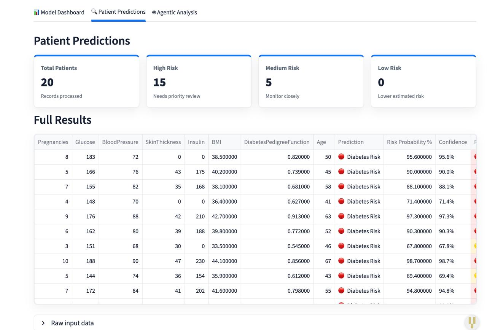
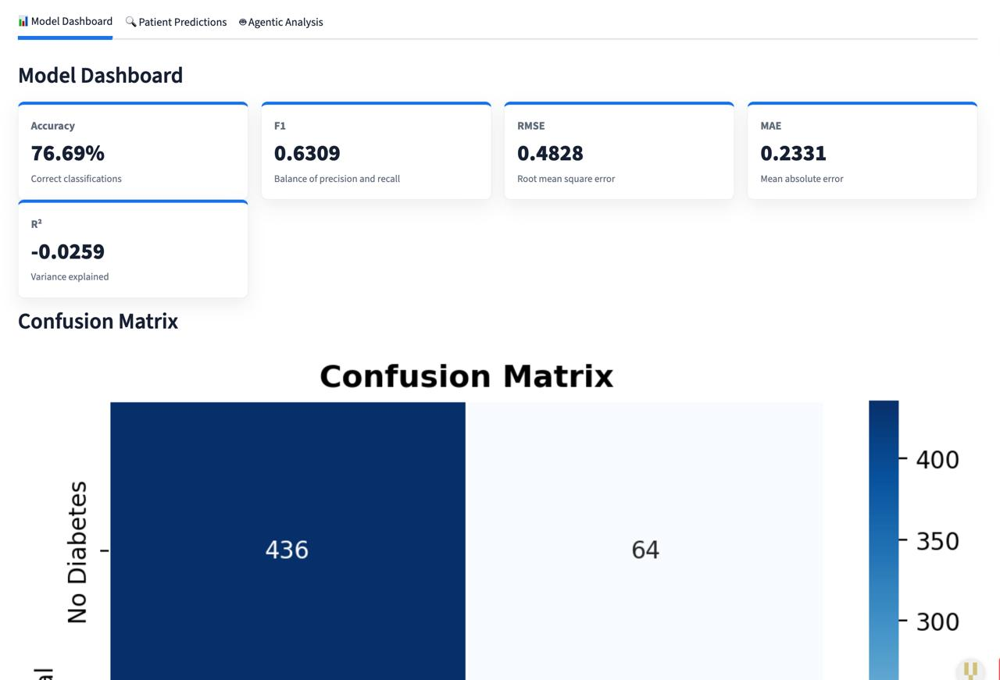
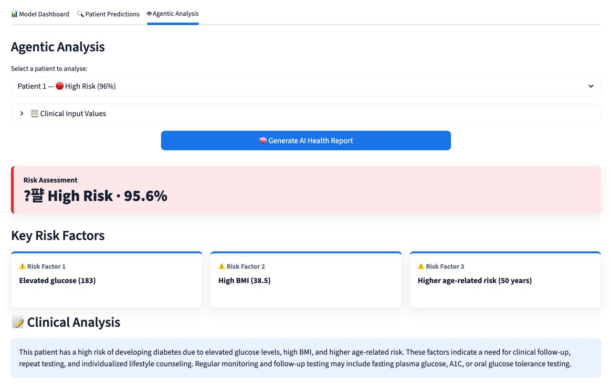
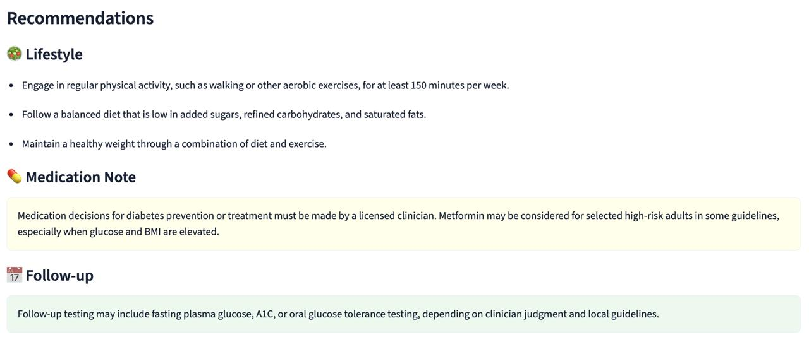
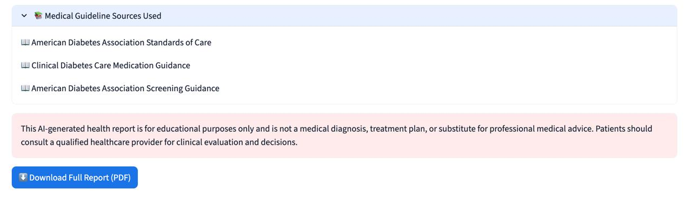

# 🏥 Intelligent Patient Risk Assessment & Agentic Health Support System

[](https://python.org)
[](https://streamlit.io)
[](https://langchain-ai.github.io/langgraph/)
[](https://www.trychroma.com/)
[](https://groq.com)
[](https://scikit-learn.org)
[](LICENSE)
[](https://gen-ai-project-2-cfkwappxr4v6v9uepcspfpc.streamlit.app/)

**From Predictive Healthcare Analytics to Agentic AI Health Support**

An end-to-end AI healthcare system that combines classical ML-based diabetes risk prediction (Milestone 1) with a 4-node LangGraph agentic assistant that autonomously reasons over patient data, retrieves medical guidelines via RAG, and generates structured AI health reports (Milestone 2).

[🌐 Live Demo](https://gen-ai-project-2-cfkwappxr4v6v9uepcspfpc.streamlit.app/) · [📁 GitHub Repo](https://github.com/kchhillar13/Gen-AI-project-2) · [📄 Report (Overleaf)](https://www.overleaf.com/read/jzwsvpstbbfg#ef942d)

---

*Developed for **Intro to Gen AI** · NST Sonipat · Milestone 1 + Milestone 2*

---

> ⚠️ **Medical Disclaimer:** This tool is strictly for educational purposes and is **not** a medical diagnosis, treatment plan, or substitute for professional medical advice. Always consult a qualified healthcare provider.

---

## 📌 Overview

The **Intelligent Patient Risk Assessment & Agentic Health Support System** is a two-milestone AI project built on the Pima Indians Diabetes Dataset.

**Milestone 1** delivers a classical ML pipeline: preprocessing, Logistic Regression, evaluation metrics, and a three-tab Streamlit UI with dataset upload, predictions, and model evaluation.

**Milestone 2** extends the system into a full agentic AI assistant powered by LangGraph. When a patient is selected, a 4-node agent autonomously identifies risk factors, retrieves relevant diabetes guidelines from a ChromaDB vector store via RAG, sends the context to Groq's LLaMA 3.1 model, and returns a structured health report — complete with clinical analysis, lifestyle recommendations, medication notes, follow-up guidance, and source attribution. The report can also be downloaded as a PDF.

---

## 🖼️ Screenshots

### Tab 1 — Predictions & Risk Assessment


### Tab 2 — Model Evaluation Metrics


### Tab 3 — Agentic AI Health Report


### AI Health Report — High Risk Patient


### Guideline Sources & Disclaimer


---

## 🗺️ Milestones & Deliverables

### Milestone 1 — ML-Based Risk Assessment *(Mid-Semester)* ✅

**Objective:** Design and implement a machine learning–based healthcare analytics system that predicts patient health risks using structured clinical data, without the use of LLMs.

| Deliverable | Status |
|---|---|
| Problem understanding & use case description | ✅ Complete |
| Input–output specification | ✅ Complete |
| System architecture | ✅ Complete |
| ML model implementation (`preprocess.py`, `model.py`) | ✅ Complete |
| Working deployed application with UI | ✅ Complete |
| Model evaluation report (Accuracy, F1, RMSE, MAE, R²) | ✅ Complete |

---

### Milestone 2 — Agentic AI Health Support Assistant *(End-Semester)* ✅

**Objective:** Extend the risk assessment system into an agent-based AI application that autonomously reasons about patient risk profiles, retrieves medical guidelines (RAG), and generates structured health recommendations.

| Deliverable | Status |
|---|---|
| LangGraph 4-node agent workflow (`agent.py`) | ✅ Complete |
| RAG pipeline with ChromaDB vector store (`rag.py`) | ✅ Complete |
| Structured AI health report generation (Tab 3) | ✅ Complete |
| Groq LLM integration (LLaMA 3.1 8B) | ✅ Complete |
| Graceful error & hallucination handling | ✅ Complete |
| Publicly deployed application (Streamlit Cloud) | ✅ Complete |
| GitHub repository & complete codebase | ✅ Complete |
| Demo video (system walkthrough) | ✅ Complete |

---

## 📊 Evaluation Criteria

| Phase | Weight | Criteria |
|---|---|---|
| **Mid-Sem (Milestone 1)** | 25% | Correct application of ML concepts · Quality of preprocessing & feature selection · Model performance & evaluation metrics · Code modularity & UI usability |
| **End-Sem (Milestone 2)** | 30% | Quality & reliability of agent reasoning · Correct RAG implementation & state management · Clarity & structure of health reports · Ethical responsible AI & deployment success |

---

## 🌐 Live Demo

🔗 **https://gen-ai-project-2-cfkwappxr4v6v9uepcspfpc.streamlit.app/**

---

## ✨ Features

| Feature | Description |
|---|---|
| 📤 **Dataset Upload** | Upload your own CSV or Excel file with patient data |
| 🔴 **High Risk Sample** | Built-in dataset of 20 high-risk patients for instant demo |
| 🟢 **Low Risk Sample** | Built-in dataset of 20 low-risk patients for instant demo |
| 📊 **Risk Prediction** | Per-patient ML prediction: Diabetes Risk / No Diabetes |
| 🎯 **Risk Levels** | Patients classified as 🔴 High / 🟡 Medium / 🟢 Low risk |
| 📈 **Evaluation Metrics** | Accuracy, RMSE, MAE, R² Score + Confusion Matrix |
| 🧠 **Agentic AI Report** | 4-node LangGraph agent generates a full clinical health report |
| 📚 **RAG Guidelines** | ChromaDB retrieves relevant diabetes guidelines (ADA, CDC, etc.) |
| 💬 **LLM Analysis** | Groq (LLaMA 3.1 8B) provides plain-language clinical reasoning |
| ⬇️ **PDF Download** | Export the full AI health report as a PDF file |
| ⬇️ **CSV Download** | Export full prediction results as a CSV file |

---

## 🛠️ Tech Stack

### Milestone 1 — ML Pipeline

| Technology | Version | Purpose |
|---|---|---|
| Python | 3.9+ | Core programming language |
| Streamlit | ≥ 1.32.0 | Web application UI — all tabs, charts, file uploader |
| Scikit-Learn | ≥ 1.4.0 | Logistic Regression model, StandardScaler, evaluation metrics |
| Pandas | ≥ 2.2.0 | Data loading, zero-imputation, results table construction |
| NumPy | ≥ 1.26.0 | Array operations and RMSE computation |
| Matplotlib | ≥ 3.8.0 | Chart rendering |
| Seaborn | ≥ 0.13.0 | Confusion matrix and correlation heatmap |
| Joblib | ≥ 1.3.0 | Saving and loading `model.pkl` and `scaler.pkl` |
| Openpyxl | ≥ 3.1.0 | Reading `.xlsx` files uploaded by users |

### Milestone 2 — Agentic AI

| Technology | Version | Purpose |
|---|---|---|
| LangGraph | Latest | 4-node stateful agent workflow orchestration |
| ChromaDB | Latest | Persistent vector store for RAG guideline retrieval |
| Groq API | — | LLM inference endpoint (LLaMA 3.1 8B Instant) |
| LLaMA 3.1 8B | `llama-3.1-8b-instant` | Open-source LLM for health report generation |
| HashingVectorizer | Scikit-Learn | Local embedding function for ChromaDB (no downloads) |
| Requests | Latest | HTTP client for Groq API calls |
| ReportLab / FPDF | Latest | PDF generation for downloadable health reports |

---

## 🤖 Milestone 2 — Agentic AI Architecture

### LangGraph Agent Workflow

The agent is built as a 4-node directed acyclic graph using LangGraph's `StateGraph`. Each patient interaction triggers the full pipeline automatically.

```
[Patient Dict]
      │
      ▼
┌─────────────────────────┐
│  Node 1                 │
│  analyze_patient_risk   │  ← Identifies risk factors from clinical values
│  (agent.py)             │    (glucose, BMI, blood pressure, age, pedigree)
└──────────┬──────────────┘
           │
           ▼
┌─────────────────────────┐
│  Node 2                 │
│  retrieve_medical_      │  ← Queries ChromaDB vector store (RAG)
│  guidelines (rag.py)    │    Returns top-3 relevant guideline chunks
└──────────┬──────────────┘
           │
           ▼
┌─────────────────────────┐
│  Node 3                 │
│  generate_ai_report     │  ← Sends patient data + risk factors + guidelines
│  (agent.py → Groq API)  │    to Groq (LLaMA 3.1 8B) → structured JSON report
└──────────┬──────────────┘
           │
           ▼
┌─────────────────────────┐
│  Node 4                 │
│  validate_report        │  ← Normalises LLM output, fills missing fields,
│  (agent.py)             │    ensures safe rendering in Streamlit Tab 3
└──────────┬──────────────┘
           │
           ▼
    [Structured Report]
```

### Agent State (`HealthAgentState`)

The agent carries an explicit TypedDict state across all four nodes:

| Field | Type | Description |
|---|---|---|
| `patient` | `Dict` | Raw patient clinical values + ML-predicted risk |
| `risk_factors` | `List[str]` | Up to 3 identified clinical risk factors |
| `guideline_query` | `str` | Natural-language query built from patient profile |
| `guidelines` | `List[str]` | Top-3 retrieved guideline chunks from ChromaDB |
| `draft_report` | `Dict` | Raw JSON report from Groq LLM |
| `report` | `Dict` | Validated, normalised final report for Streamlit |

### RAG Pipeline (`rag.py`)

The RAG layer uses ChromaDB as a persistent vector store populated with **6 curated diabetes guideline chunks** sourced from:

- American Diabetes Association Standards of Care
- CDC Diabetes Prevention Program Guidance
- ADA Cardiovascular Risk Guidance
- ADA Screening Guidance
- Clinical Diabetes Care Medication Guidance
- Diabetes Self-Management Education Guidance

**Embedding:** A local `HashingVectorizer` (384 features, L2 norm, cosine similarity) is used — avoiding any external model downloads and keeping the system fully deterministic for educational environments.

**Fallback:** If ChromaDB encounters a dependency conflict on Streamlit Cloud, the system automatically falls back to in-memory cosine similarity retrieval using the same vectorizer — guaranteeing the agent always completes.

### Structured Report Output

The LLM is prompted to return a strict JSON schema:

```json
{
  "risk_level": "🔴 High Risk | 🟡 Medium Risk | 🟢 Low Risk",
  "risk_probability_pct": "87%",
  "key_risk_factors": ["factor 1", "factor 2", "factor 3"],
  "risk_explanation": "Plain-language clinical analysis (3–5 sentences)",
  "recommendations": {
    "lifestyle": ["recommendation 1", "recommendation 2", "recommendation 3"],
    "medication_note": "Non-prescriptive medication safety note",
    "follow_up": "Recommended follow-up timing and clinical checks"
  },
  "guideline_sources": ["source 1", "source 2", "source 3"],
  "disclaimer": "Mandatory medical advice disclaimer"
}
```

`validate_report` (Node 4) ensures every field is populated and type-safe before Streamlit renders the report, preventing crashes from partial LLM outputs.

### Hallucination Reduction Strategies

- **Temperature 0.2** — low randomness for factual clinical output
- **Strict JSON schema** enforced via `response_format: json_object`
- **System prompt constraints** — agent is explicitly told not to diagnose or prescribe
- **Structured RAG context** — LLM only reasons over pre-vetted guideline chunks
- **Node 4 validation** — all missing/malformed fields are replaced with safe defaults
- **Mandatory disclaimer** injected into every report at the code level

---

## 📂 Dataset

The **Pima Indians Diabetes Dataset** was originally collected by the National Institute of Diabetes and Digestive and Kidney Diseases (NIDDK), USA. It is a standard ML benchmark available on Kaggle and the UCI Repository.

| Attribute | Detail |
|---|---|
| Total Records | 768 patients |
| Input Features | 8 numeric clinical measurements |
| Target Variable | `Outcome` — binary (0 = No Diabetes, 1 = Diabetes) |
| Class Distribution | 500 No Diabetes (65.1%) · 268 Diabetes (34.9%) |

| # | Feature | Description |
|---|---|---|
| 1 | `Pregnancies` | Number of times pregnant |
| 2 | `Glucose` | Plasma glucose concentration (mg/dL) |
| 3 | `BloodPressure` | Diastolic blood pressure (mm Hg) |
| 4 | `SkinThickness` | Triceps skinfold thickness (mm) |
| 5 | `Insulin` | 2-hour serum insulin (µU/mL) |
| 6 | `BMI` | Body mass index (kg/m²) |
| 7 | `DiabetesPedigreeFunction` | Diabetes likelihood based on family history |
| 8 | `Age` | Patient age in years |

---

## 📁 Project Structure

```
Gen-AI-project-2/
│
├── src/
│   ├── app.py              ← Streamlit UI: sidebar, 3 tabs, PDF download
│   ├── agent.py            ← LangGraph 4-node health agent + Groq LLM
│   ├── rag.py              ← ChromaDB RAG pipeline + local fallback retriever
│   ├── model.py            ← Logistic Regression training & predict_risk()
│   └── preprocess.py       ← Data cleaning, StandardScaler, train/test split
│
├── data/
│   ├── diabetes.csv                ← Pima Indians training dataset
│   ├── sample_high_risk.csv        ← 20 pre-built high-risk patient records
│   └── sample_low_risk.csv         ← 20 pre-built low-risk patient records
│
├── models/
│   ├── model.pkl           ← Saved trained Logistic Regression model
│   └── scaler.pkl          ← Saved fitted StandardScaler
│
├── chroma_db/              ← Persistent ChromaDB vector store (auto-created)
│
├── .streamlit/
│   └── config.toml         ← Streamlit theme and server settings
│
├── assets/
│   └── screenshots/        ← App screenshots (used in this README)
│
├── requirements.txt        ← All Python dependencies with version pins
├── runtime.txt             ← Python version for Streamlit Cloud
└── README.md               ← This file
```

---

## 🚀 How to Run Locally

### Prerequisites

- Python 3.9 or higher
- `git` installed
- A free [Groq API key](https://console.groq.com/) (for Tab 3 Agentic Analysis)

### Step-by-step

**1. Clone the repository**

```bash
git clone https://github.com/kchhillar13/Gen-AI-project-2.git
cd Gen-AI-project-2
```

**2. Create and activate a virtual environment**

```bash
python3 -m venv venv
source venv/bin/activate        # macOS / Linux
# venv\Scripts\activate         # Windows
```

**3. Install all dependencies**

```bash
pip install -r requirements.txt
```

**4. Train and save the ML model**

```bash
python src/model.py
```

This generates `models/model.pkl` and `models/scaler.pkl` automatically.

**5. Set your Groq API key**

```bash
export GROQ_API_KEY="your_groq_api_key_here"   # macOS / Linux
# set GROQ_API_KEY=your_groq_api_key_here       # Windows CMD
```

> **Get a free key at:** https://console.groq.com/ — no credit card required.

**6. Launch the Streamlit app**

```bash
streamlit run src/app.py
```

The app will open at **http://localhost:8501**

---

### Setting up Groq API Key for Deployment (Streamlit Cloud)

If you are deploying to Streamlit Community Cloud:

1. Go to your app dashboard → **⋮ Menu → Settings → Secrets**
2. Add the following:

```toml
GROQ_API_KEY = "your_groq_api_key_here"
```

---

## 🧠 ML Methodology (Milestone 1)

### Data Preprocessing

The raw dataset contains biologically impossible zero values in `Glucose`, `BloodPressure`, `SkinThickness`, `Insulin`, and `BMI` — these represent missing measurements recorded as zeros. All such zeros are replaced with `NaN` and imputed using the **column median** (preferred over mean due to robustness against outliers). Features are then standardised using `StandardScaler` (zero mean, unit variance) to prevent large-scale features like Insulin from dominating the model. The dataset is split **80% training / 20% testing** with `random_state=42` for full reproducibility.

### Model — Logistic Regression

Logistic Regression was selected because:
- Well-suited to **binary classification** (diabetic / non-diabetic)
- Produces **calibrated probability outputs** — powering the risk percentage display
- Highly **interpretable** — coefficients can be explained to stakeholders
- Strong, transparent baseline for a healthcare education context

### Results

| Metric | Value |
|---|---|
| Accuracy | **75.32%** |
| Precision (Diabetes) | 0.67 |
| Recall (Diabetes) | 0.62 |
| F1-Score | 0.64 |
| RMSE | ~0.497 |
| MAE | ~0.247 |
| R² Score | ~0.01 |

### Confusion Matrix

| | Predicted: No Diabetes | Predicted: Diabetes |
|---|---|---|
| **Actual: No Diabetes** | 82 ✅ (True Negative) | 17 ⚠️ (False Positive) |
| **Actual: Diabetes** | 21 ❌ (False Negative) | 34 ✅ (True Positive) |

> The 21 False Negatives (missed diagnoses) are the most consequential errors in a healthcare context — which is why **Recall** is prioritised alongside Accuracy.

---

## 🖥️ App Walkthrough

### Sidebar — Data Source

Choose one of three options:
- 📤 Upload your own CSV or Excel patient dataset
- 🔴 Use the built-in High Risk sample (20 patients)
- 🟢 Use the built-in Low Risk sample (20 patients)

### Tab 1 — Predictions & Risk Assessment

- Summary cards: Total Patients · High Risk · Medium Risk · Low Risk
- Full results table with Prediction, Risk Probability %, Confidence, Risk Level
- Raw input data expander
- Download results as CSV

### Tab 2 — Model Evaluation Metrics

*(Available when uploaded data includes an `Outcome` column)*

- Accuracy, RMSE, MAE, R² Score metric cards
- Annotated Confusion Matrix heatmap
- Plain-English explanation of each metric

### Tab 3 — Agentic AI Health Report

- Select any patient from the loaded dataset
- View clinical input values in an expandable table
- Click **🧠 Generate AI Health Report** to trigger the LangGraph agent
- Report renders with:
  - Risk level banner (colour-coded by severity)
  - 3 key risk factor cards
  - Clinical analysis (3–5 sentence LLM-generated explanation)
  - Lifestyle recommendations list
  - Medication safety note
  - Follow-up guidance
  - Expandable guideline sources (ADA, CDC, etc.)
  - Mandatory medical disclaimer
- **Download the full report as a PDF**

---

## 👥 Team

| Name | Enrollment No. | Role |
|---|---|---|
| Nishant Sharma | 2401010302 | Data Engineering, RAG Pipeline & Deployment |
| Dev Tyagi | 2401010148 | ML Model, LangGraph Agent & Groq Integration |
| Karan Chhillar | 2401010211 | UI Design, Tab 3 Frontend & PDF Report |

### Milestone 1 Contributions

| Name | Key Contributions |
|---|---|
| Nishant Sharma | Data preprocessing (`preprocess.py`), zero-imputation, StandardScaler, sample datasets, GitHub setup & management, Streamlit Cloud deployment |
| Dev Tyagi | Model training (`model.py`), Logistic Regression, all evaluation metrics (Accuracy, Precision, Recall, F1, RMSE, MAE, R²), `evaluate_dataset()` function |
| Karan Chhillar | Streamlit interface (`app.py`), all 3 tabs, sidebar, charts, download button, error handling, responsive layout |

### Milestone 2 Contributions

| Name | Key Contributions |
|---|---|
| Nishant Sharma | RAG pipeline (`rag.py`), ChromaDB vector store setup, local HashingVectorizer embedding, ChromaDB fallback retriever, updated Streamlit Cloud deployment with Groq secrets |
| Dev Tyagi | LangGraph agent design (`agent.py`), all 4 agent nodes, Groq API integration, prompt engineering, hallucination reduction strategies, agent state management |
| Karan Chhillar | Tab 3 Agentic Analysis UI (`app.py`), health report rendering (banners, cards, expandable sections), PDF report generation & download, end-to-end UI/UX polish |

**Course:** Intro to Gen AI · NST Sonipat  
**Instructor:** Bipul Shahi

---

## 📄 License

This project is licensed under the [MIT License](LICENSE).

---

Made with ❤️ for Intro to Gen AI · NST Sonipat

⭐ If you found this useful, consider starring the repository!